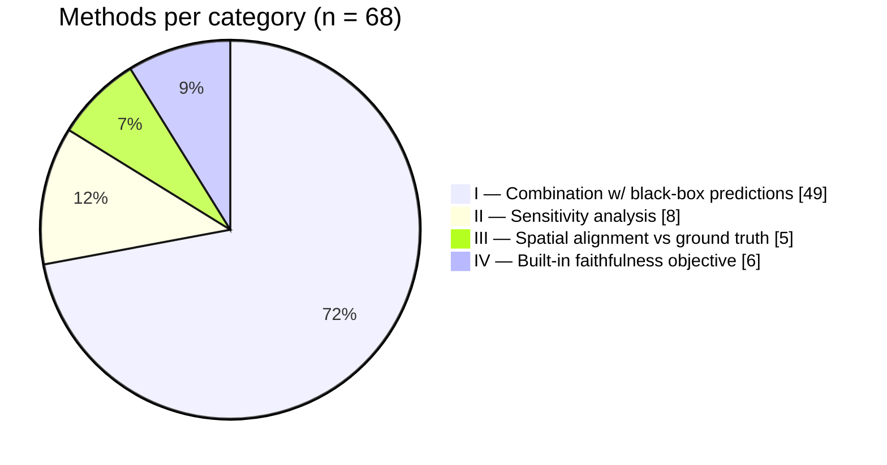

# xai-faithfulness-taxonomy

Interactive taxonomy of **68 faithfulness evaluation methods in imaging
explainable AI (XAI)** — a companion site to the systematic review by
Lamprou, Kallipolitis, Ntanos & Askounis (2026).

## The interactive taxonomy

The site lets you browse all 68 methods grouped by category, with full-text
search and category filtering.

**Live site:** <https://nasskall.github.io/xai-faithfulness-taxonomy/> — **live now.**

> ℹ️ The site is served by GitHub Pages from this repository. On the GitHub
> Free plan Pages only serves **public** repositories, so the live URL works as
> long as this repository stays public; if it is made private again the URL
> returns 404 until it is public once more. You can always run it locally
> regardless of visibility — see [Local preview](#local-preview).

## The paper

**A Taxonomy of Faithfulness Evaluation Methods for Post-hoc Attribution Maps in Imaging XAI: A Systematic Review** (2026).

**Authors:** Vangelis Lamprou¹\*, Athanasios Kallipolitis², Christos Ntanos¹,
Dimitris Askounis¹

- ¹ Decision Support Systems Laboratory, National Technical University of
  Athens, 9 Iroon Polytechniou str., 15780, Zografou, Athens, Greece
- ² Department of Digital Systems, University of Piraeus, 18534 Piraeus, Greece
- \* Correspondence: `vlamprou@epu.ntua.gr`

**Summary.** Faithfulness is one of the most widely used properties for
evaluating explanation quality in XAI, but it is not uniformly conceptualized
across studies. This review systematically investigates how faithfulness is
operationalized in post-hoc, attribution-based XAI methods for imaging data. A
systematic search of Scopus and IEEE Xplore (final search 15 December 2025)
included studies that focused on the imaging modality, employed neural
networks, produced post-hoc visual explanations with attribution scores, and
defined and numerically quantified faithfulness. From **107 included studies**,
the authors derive a taxonomy of **68 faithfulness methods** organized across
**4 categories**, based on how attribution scores are used to formulate a
faithfulness argument:

| # | Category | Methods |
|---|----------|--------:|
| I | Combination of attribution scores & black-box predictions | 49 |
| II | Sensitivity analysis of attribution scores | 8 |
| III | Spatial alignment against a ground-truth region | 5 |
| IV | Built-in faithfulness objective | 6 |

Key findings include that **perturbation-based reasoning is the dominant
evaluation paradigm (49 of the 68 methods)**, that linearity assumptions recur
across 18 methods, and that faithfulness is terminologically entangled with the
related properties of fidelity, plausibility, and stability.

**Keywords:** faithfulness; explainable artificial intelligence; attribution
maps; post-hoc; systematic review; imaging data; taxonomy

## Data

`taxonomy.json` contains the full dataset of **68 methods across the 4
categories** (11 sub-categories), transcribed from Tables 1–11 of the paper.
Distribution: I.A.1=18, I.A.2=8, I.B=10, I.C=4, I.D=1, I.E=8, II.A=4, II.B=3,
II.C=1, III=5, IV=6.

Each method's `references[]` entry holds its **defining work only** (e.g.
`Bach et al. (2015)`). The full per-method lists of *review studies* that use
each method are **not** reproduced here — they remain authoritative in the
paper's tables. `taxonomy.csv` is a flat export of the same 68 rows for
spreadsheet users; it is kept in sync with the JSON and is not read by the site.

## Visualizations

Distribution of the 68 methods across the four top-level categories (rendered
natively by GitHub):



The interactive site shows this same breakdown as a bar chart at the top of the
page.

## Project layout

| File | Purpose |
|------|---------|
| `index.html` | Page shell, search/filter controls, empty/error states |
| `styles.css` | Styling |
| `data.js` | Loads & normalizes `taxonomy.json` (ES module) |
| `app.js` | Renders cards, search, category filter (ES module) |
| `taxonomy.json` | **Canonical dataset** consumed by the site |
| `taxonomy.csv` | Flat export (kept in sync; not read by the site) |
| `.github/workflows/pages.yml` | GitHub Actions workflow that deploys the site to Pages |

## Data schema

`taxonomy.json`:

```json
{
  "title": "Faithfulness Evaluation Methods in Imaging XAI",
  "source": "Data transcribed from Tables 1-11 of Lamprou, Kallipolitis, Ntanos & Askounis (2026) — 107 review studies, 68 methods, 4 categories ...",
  "version": "1.1.0",
  "methods": [
    {
      "id": "kebab-case-unique-id",
      "name": "Method name",
      "category": "Top-level category",
      "subcategory": "Finer grouping (may be empty)",
      "description": "One- or two-sentence summary. Computation: <type>.",
      "tags": ["subcategory-code", "computation-type"],
      "references": [
        { "text": "Author et al. (Year)", "url": "https://doi.org/10.xxxx/..." }
      ]
    }
  ]
}
```

Field notes:

- `id`, `name`, `category`, `description` are present on every entry.
- `subcategory`, `tags`, `references` are optional. `references[].url` is
  schema-optional but **populated for all 68 methods** in the current data: an
  arXiv link where the paper prints an arXiv id, otherwise a Crossref-verified
  DOI, otherwise a Google Scholar title-search link.
- Categories shown on the site are derived automatically from each method's
  `category` value — no separate category list to maintain.

The current dataset is `version` **1.1.0**. `taxonomy.csv` mirrors the same
rows; its `references` cell uses the form `Author et al. (Year) <url>`.

## Local preview

The site uses `fetch()` to load `taxonomy.json`, which browsers block when a
page is opened directly from disk (`file://`). Serve the folder over HTTP:

```bash
# from the project root
python -m http.server 8000
# then open http://localhost:8000
```

In PyCharm you can also right-click `index.html` → **Open in Browser**, which
uses the IDE's built-in web server (HTTP) and works the same way.

## Deployment

Pushing to `main` triggers `.github/workflows/pages.yml`, which uploads the
repository root as a Pages artifact and deploys it. This requires:

1. the repository to be **public** (GitHub Pages is unavailable for private
   repositories on the Free plan), and
2. Pages configured with **GitHub Actions** as the source (Settings → Pages →
   Source: *GitHub Actions*).

The repository is currently **public** and the site is live at
<https://nasskall.github.io/xai-faithfulness-taxonomy/>. If the repository is
made private again, the workflow still runs on each push but the deployment
step fails by design and the URL returns 404 until it is public once more.

## License

Code is released under the [MIT License](./LICENSE). Update the copyright
holder in `LICENSE` if it should credit the paper's authors or institution
rather than the repository maintainer. The MIT license covers the **site
code**; licensing of the taxonomy/research content follows the terms of the
paper.
